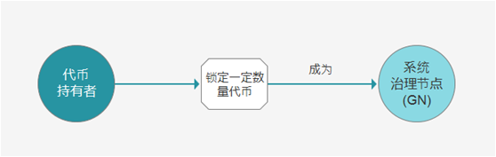

# Governance of Consensus
## ⸺打造全球最佳治理实践的公链
 
### 白皮书 1.1 版本
### 2018年10月31日

摘要
====

区块链日益成为新的全球基础设施，正在重塑传统产业和金融体系。公链是区块链通证经济的核心基础设施，是新型经济体。**通证**、**应用**和**治理**是公链的三要素，**治理是公链必不可少的工具**。

由于区块链发展时间尚短，现存大多数公链对于治理都欠缺考虑，治理在公链中的意义与价值被严重低估；部分公链即使推出了治理模型，也缺乏基本的公链制度建设和公链生态良性自成长机制。治理的失效严重阻碍了公链共同体的发展。

公链领域迫切需要一套系统、有效的治理机制，来引导公链共同体的繁荣发展。为此，我们发起成立GOC公链与社群，致力于建设全球最佳治理实践的公链，并聚合全球范围对公链经济体感兴趣的人士构建分布式社群，推动公链共同体的建设。

GOC在汲取现有公链治理经验和教训的基础上，在理念上主张公链的良性治理原则。在治理模型上有创新的系统设计，并形成良性的生态自成长机制。实现方式上，

GOC在现有全球大型公链底座的基础上，创造一个“小而美”的良性治理公链，为全球公链治理建立典范。

我们将站在为社会公众负责的客观视角，秉承独立性、中立性、专业性的态度来推动公链经济体形成良好的治理，进而更好地为各类应用项目与公链生态参与者赋能。

目录
====

>   摘要
>   .....................................................................................................................................................
>   1 1、成立背景
>   ......................................................................................................................................
>   4

>   1.1 基本介绍
>   ...............................................................................................................................
>   4

>   1.2 解决方案
>   ...............................................................................................................................
>   8

1.  GOC公链
    ...................................................................................................................................
    11

    1.  GOC公链愿景
        ....................................................................................................................
        11

    2.  GOC定位
        ...........................................................................................................................
        11

    3.  GOC设计原则
        ....................................................................................................................
        11

    4.  GOC特点
        ...........................................................................................................................
        11

    5.  GOC是EOS基座的多样化实现
        ........................................................................................
        12

    6.  GOC的未来图谱
        ...............................................................................................................
        12

2.  GOC公链治理方案
    ...................................................................................................................
    13

    1.  生态参与角色
        .....................................................................................................................
        13

    2.  生态角色间的基本约束关系
        ..............................................................................................
        13

    3.  生态参与者角色与活动详细定义
        ......................................................................................
        15

        1.  Token持有者
            ..............................................................................................................
            16

>   3.3. 2 区块生产节点（Block Producer，BP）
>   ............................................................... 17
>   3.3.3 系统治理节点（Governance Node, GN）
>   ........................................................... 18 3.3.4
>   第三方服务提供商
>   .....................................................................................................
>   19 3.3.5 dApp开发者
>   ..............................................................................................................
>   20 3.4 主要治理系统
>   .....................................................................................................................
>   20

1.  区块生产节点（BP）投票规则
    ................................................................................
    20

2.  系统治理节点（GN）加入规则
    ...............................................................................
    21 3.4.3 提案申请和激励机制
    .................................................................................................
    22 3.5 关键治理规则
    .....................................................................................................................
    24

3.  BP 构成
    .......................................................................................................................
    24

4.  BP 共识系统
    ...............................................................................................................
    24

5.  制约机制
    .....................................................................................................................
    24 3.6 对外输出
    .............................................................................................................................
    25

6.  GOC公链技术系统
    ...................................................................................................................
    26

    1.  共识算法 (BFT-DPOS)
        ......................................................................................................
        26

    2.  分层级帐户体系
        .................................................................................................................
        26

        1.  操作 & 处理
            ...............................................................................................................
            26

        2.  基于角色的权限管理
            .................................................................................................
            27

        3.  权限映射
            .....................................................................................................................
            27

    3.  操作亮点
        .............................................................................................................................
        27

        1.  应用程序的确定性并行执行
            ......................................................................................
            27

        2.  只读操作处理
            .............................................................................................................
            27

        3.  自主最优调度
            .............................................................................................................
            28

        4.  延迟交易
            .....................................................................................................................
            28

        5.  上下文无关操作
            .........................................................................................................
            28

    4.  模型与资源使用
        .................................................................................................................
        29

        1.  委托能力
            .....................................................................................................................
            29

        2.  分离交易成本与价值
            .................................................................................................
            29

        3.  状态存储成本
            .............................................................................................................
            29 4.4.4 Block Rewards 块奖励
            ............................................................................................
            30

>   4.4.5 提案制度
>   .....................................................................................................................
>   30

1.  治理
    .....................................................................................................................................
    30

2.  跨链通信
    ............................................................................................................................
    31

    1.  用于轻客户端的Merkle (LCV)证明
        .........................................................................
        31

    2.  跨链通信的延时
        ........................................................................................................
        31

    3.  完备性证明
        .................................................................................................................
        32

3.  Token经济系统
    .........................................................................................................................
    33
    Token主要应用场景
    ..........................................................................................................
    33 5.2 参与治理活动
    .....................................................................................................................
    33

>   5.2.1 投票
>   .............................................................................................................................
>   33 5.2.2 加入系统治理节点
>   .....................................................................................................
>   33

1.  提案
    .............................................................................................................................
    33

2.  治理服务
    .....................................................................................................................
    34 5.3 调用系统资源
    .....................................................................................................................
    34 5.4 奖励社区建设行为
    .............................................................................................................
    34

>   5.5 Token发行机制
>   ..................................................................................................................
>   34

1.  Token分配机制
    ..........................................................................................................
    34

2.  捐赠回馈
    .....................................................................................................................
    35

3.  志愿者团队激励
    .........................................................................................................
    35 5.5.4 GOC公链发展基金
    ....................................................................................................
    35

>   5.5.5 社区生态建设激励
>   .....................................................................................................
>   36

1.  Token的获得方式
    ..............................................................................................................
    36

2.  Token的通缩
    ......................................................................................................................
    36

3.  Token的增发
    ......................................................................................................................
    37

1、成立背景
===========

>   新一代区块链系统软件 EOSIO 由 Dan Larimer（简称BM）设计和领导开发。

BM 崇尚自由及具有竞争的区块链系统，这样的系统不但能够在竞争过程中保证长期的
**chapter 1** 生命力和去中心化，还能够以 EOSIO
为底座，创造出一个无国界的全球区块链共同

>   体。这些有着同样EOS底座的区块链并行协同工作，能够达到几乎无限的每秒交易速度

>   （TPS）。因此在设计 EOSIO 软件系统的过程中，BM 特地加入了可令各条使用 EOSIO

>   软件的区块链系统之间的跨链协同机制。而 BM 本人，也不断地公开呼吁用该软件建

>   立其他的区块链系统。

>   目前的 EOS 主网同样是基于 EOSIO这个全球区块链共同体的软件底座所创建的。

>   EOS 主网尝试使用 DPOS 及 1 票多投机制来解决去中心化的系统问题，用 ECAF
>   仲裁来解决纠纷和保护投票过程中可能产生的中心化问题，用代币通胀来支付系统出块和系统演进。但值得注意的是，目前的主网完全处于治理失效的状态。在代码层面上，公投、系统演进等功能并未实现；在非代码层面上，ECAF
>   失效。整个主网系统失灵严重。但由于主网对应的代币价值高达上百亿美元，在主网上进行治理实践成本太大。

1.1 基本介绍
------------

>   统》的论文为起点，指以比特币为代表的数字货币应用，其应用场景限制在支付流通等数字货币领域，完成了去中心化的记账功能，树立了“代码即规则”的理念，建立了无中心化机构介入的通证体系。区块链
>   0.1 的重要意义在于创造出一套不依赖中心化机构

（例如：发钞行、支付和清算机构等）的通证体系，去中心化的结构使用户避免由于中
**chapter 1** 心化机构的失灵而蒙受损失。但是，区块链 0.1
依然停留在有限的交易和支付场景，对日常生活带来的边际改进有限。除此之外，区块链
0.1
通过增加冗余来增强安全性并解决信任问题，其代价是耗费一个国家的电力来运行一台个人电脑的功能；从使用者角度来看，全网只能完成每秒钟
10 次不到交易，转账耗时平均 10 分钟左右，系统运行效率十分低下。

>   区块链 0.2 以 2015 年 7
>   月上线的以太坊为代表，将数字货币和智能合约相结合，使更复杂的程序、合约、自治组织也能以去中心化的形式得以运行，智能合约使区块链通证经济得以建立，区块链的使用场景也由此迅速扩张，被引入金融、物联网、农产品追溯、招标竞价、确权、签名、众筹等领域。但是，区块链
>   0.2
>   依然沿用比特币“用冗余交换去中心化”的理念，因此，交易速度和资源损耗的问题仍然存在，以太坊
>   16,700
>   个节点同时运行，使用一个国家的电力消耗来处理一个节点就能处理的功能，但是每秒

>   础上，需要设计出一套有效的区块链治理体系。理服务”，包括“争端解决”、“投票”等服务，打破“代码即规则”的概念，重新将

“治理”这个关于“人”的因素纳入到区块链应用中，用“人+代码”来解决复杂的人的问题，以“治理”来减少节点数量，提高区块链的效率，使区块链可以应用到更多场景中。元道则进一步指出，区块链
0.3 的当务之急是思考如何结构性成长、如何自我迭 **chapter 1**
代、自我演进、自我修复，而通证、应用和治理是公链的三大要素，这些目标的达成离不开成熟的治理结构设计，只有真正达到了这些要求，真正的公链区块链
1.0 才能真正落地实现。区块链 0.3 以 2018 年 6 月上线的 EOS
为代表，治理系统进一步扩展了区块链应用的场景，使人们更深刻地意识到区块链应用不仅仅是一项技术应用，更是一个经济问题。由于对于区块链治理结构的探索尚处于初期阶段，没有可借鉴的经验，治理机制设计上的缺失难以避免，这导致新生的区块链
0.3 项目产生诸多的问题，严重影响未来的发展。

>   以常见的治理设计方面较为成熟的四种治理框架为例，就其会出现的隐患做一些分析:

>   第一，治理模板A，遵循“谁的钱多谁说了算”的自由市场理念，会导致小部分持有大量代币的投资者掌握了系统中大量的权力，这些投资者的决策可以对整个系统的走

>   同样是最初区块链治理设计上的缺失所导致的。

>   第三，治理模板C，我们都很清楚，dApp生态的健康发展是公链长期价值的关键

>   性决定因素，因此，区块链治理设计之初应当加入足够的激励机制来促进dApp生态的

发展，但是，模板C生态中却缺少这样的机制；同样地，公链自身系统的开发者也需要
**chapter 1**

>   激励来持续完善公链底层架构，然而公链生态设计之初对开发者的奖励却考虑不足，直接导致系统开发后劲不足，进度缓慢。除此之外，公链上的资源价格偏高，开发成本增大，也是影响dApp开发者进入的因素，如果系统中缺少至关重要的dApp开发者的加入，基于公链的dApp生态便难以发展。

>   第四，治理模板D，因为其治理生态设计最初考虑不足，导致不同角色发展不均衡，而原本以系统运行为主要职责的节点（BP）需要参与过多决策事务，权力制约关系由于不同角色权责不均而被破坏。

>   “治理”是公有链的核心命题，“治理”设计的优劣直接决定了区块链项目未来可以走得多远，发展得多大。“治理”可以减少重复工作机器的数量，并且也可以解决共识问题。区块链可以将制度透明化和程序化，但是并不是所有的问题都可以依靠程序化

>   经济的繁荣发展。

1.2 解决方案
------------

>   链的种种问题，设计了一系列针对这些问题的解决方案。其中最重要的是，GOC
>   在其生态中增加了“系统治理节点”这个全新的角色，由这些“系统治理节点”对系统上的治理问题进行决策，这样的设计意在将系统运行维护和系统治理决策的职能分割开来，

>   防止区块生产节点控制区块链的生态运行。

**chapter 1**

>   **（1）针对小部分持有大量代币的投资者掌握系统中大量权力的问题，GOC
>   设计了以下机制予以解决。**

>   “系统治理节点”的是通过“一户一票”的形式进行投票的，按照人头而不是按照持有代币的数量来投票是为了防止拥有大量代币的持币者控制整个生态的治理决策权，这是目前区块链
>   0.3 公链的一个大问题。

>   成为“系统治理节点”仅需要锁定一定数量的代币作为抵押，不存在投票选举的机制，防止拥有大量代币的持币者通过策略性投票影响选举结果，同时也鼓励更多愿意为公链生态献计献策的持币者加入到治理决策中，分享治理决策带来的收益。

>   GOC
>   中依然保留“区块生产节点”的角色，但是权力仅限于系统运行、维护和升级的工作。

>   区块生产节点通过持币者选举产生，持币者可以通过锁定一定数量的代币来进行投票，投票的权重不再简单地和锁定的代币数量成线性关系，GOC
>   的区块生产节点投票权重中投票代币

>   **系统通证的分发设计了对应的方法，以解决上述问题。**

>   与生态的治理建设，保证了他们的话语权；

>   大，使他们对系统的话语权更大。

>   回归区块链项目发展的“初心”与“本源”，GOC
>   将不进行任何形式的募资，链上的通证均按照社区成员为生态发展做出的贡献进行分发。

>   系统初始生成的 50%
>   通证的分发与使用，将完全置于链上进行，并由全体治理节点与区块

**chapter 1**

>   生产节点共同投票决策。

>   注1： 目前区块链 0.3
>   公链项目中的大量参与者是短期投资者，追求的是短期的资本收益，他们做出的决策完全不为生态的长期发展考虑，而为系统初期建设作出重要贡献的参与者由于缺少奖励机制，所持代币数量又小，逐渐失去话语权，因此也大量地离开了生态，使短期投资者充斥生态的问题愈加严重。GOC
>   设计的治理系统可以很好地解决这个问题，留住生态上这些重要的“原住民”。

1.  **GOC
    的治理生态设计过程中十分注重不同角色之间权利的制衡问题，设计了多重机制来防止某一方角色的权力泛滥问题。**

>   持币者通过锁定代币可以来为他们中意的区块生产节点投票，分享区块生产产生的一定收益，代币一旦用于投票便不可再用于质押成为系统治理节点，防止区块生产节点和系统治理节点的角色同时控制在部分持币者手中。

>   “系统治理节点”可以对提案进行投票决策，只有投票的“系统治理节点”才能够分享治理回报，鼓励更多人实实在在地参与到治理工作中，而不是简单地占一个名额。

>   相互钳制，不会产生节点控制生态的情况。

>   力交还给代币持有人，防止节点“约束自己的规则自己定”的情况出现。

>   节点，系统治理节点从数量和参与方式上都更能体现众多持币者的意志，这样是为了防止仲裁机构重新成为系统中中心化的角色，还仲裁系统以“去中心化”的本质。

1.  **GOC 充分而深刻地了解 dApp
    生态对于公链长期发展的重要意义，因此，GOC设计了一系列鼓励资助 dApp
    发展的机制，吸引更多的开发者加入到基于GOC系统的 dApp 开发中来。**

>   dApp 开发者可以凭借其优秀的 dApp
>   项目通过提请项目资金申请提案来获取开发资金。

**chapter 1**

>   GOC 预留的代币将用于社区生态建设激励，其中包括通过资金资助来鼓励更多的 dApp
>   开发者加入到 GOC 去中心化应用开发中。

>   GOC 希望通过上述机制能更有效地鼓励 GOC 链上的 dApp 生态的发展。

1.  **GOC
    公链的生态中还会出现众多第三方服务提供商，提供诸如公证、审计、尽职调查、数据分析、系统监控等服务。**

>   第三方服务商可与服务于 GOC
>   生态的各个环节，例如争议仲裁过程中可以有专门的第三方服务提供商提供咨询服务、证据采集服务、数据分析服务以及仲裁意见服务，来帮助提请仲裁提案的争议双方以及负责做出最终决定的系统治理节点更好地完成仲裁工作。

>   第三方服务提供商将通过提供服务来获取报酬，同时，新兴的服务提供商也可以通过提请项目资金申请提案来获取初始启动资金。当系统中出现众多第三方服务提供商时，竞争机制和名誉机制将会鼓励优秀的服务提供商并淘汰劣质的服务提供商，使整个生态更加健康。

 2、GOC 公链
============

>   **2.1 GOC 公链愿景**

>   **致力成为全球区块链治理机制最为突出的公链社群经济体。**

chapter 2 2.2 GOC 定位
----------------------

>   GOC **有双层定位**：一是“共识之共识”
>   ，我们致力于解决人机共存时代的治理问题，构建希望能打造一条具有优秀治理机制的公有链经济系统，建立和输出具有示范意义和普适性的公链治理原则，形成具有共同治理原则的公链共同体；二是“共识开放社群”，我们希望打造成一个全世界对公链经济体治理感兴趣的专业人士的分布式协作社群，共同为公链经济体赋能。

2.3 GOC 设计原则
----------------

>   GOC 公链设计与社群运营的原则：

-   **公心**：为最广泛的经济体参与者服务，提升社会福祉；

-   **公平**：公平对待每一位社区参与者；

-   **公正**：如果遇到问题，我们希望秉承“公正、客观”的原则进行解决；

-   **开放**：欢迎各领域、各层次、各类角色参与到社区当中；

-   **共建**：社区成员共同参与社区生态的建设、治理；

-   **共治**：社区成员参与生态治理，共同助力生态繁荣。

2.4 GOC特点
-----------

>   基于 GOC 公链的设计原则，相比于其它公链，GOC 的特点包括：

-   **治理即挖矿**。奖励社群成员以各种方式参与治理工作。

-   **小而美**。小：不片面追求经济规模和人数规模，聚焦治理特色；美：建设具有吸
    引力的公链自治社群。

-   **生态自生长**。不断吸引原住民，建设具有强大共识的原住民公链社群，同时也欢
    迎移民，实现生态良性自生长。

-   **DApp 友好**。奖励公链上开发优秀 dApp，繁荣公链生态。

-   **社群驱动**。以社群自治精神和原则推动社群发展，逐步弱化中心化驱动。

-   **不做 ICO**。反对短期炒作，通过生态自生长创造良性价值。

**chapter 2** • **对外输出影响力**。深化良性的共同体建设。

2.5 GOC 是 EOS 基座的多样化实现
-------------------------------

-   在目前的大型公链系统中，EOS 首次提出了治理的概念和相关实现，并且建立了
    链上治理和链下治理结合的平衡和演进的方案，GOC 高度认可 EOS 在治理上的创
    新和尝试，也会在基础治理和共识机制上，参考 EOS 的优秀实现。

-   另一方面，EOS 做为新一代公链的标准，为未来的大量公链和侧链提供了高性能
    系统及社群，这种开放性和标准化，为 EOSIO 的大生态提供了无限的可能性。

-   GOC 社群正是出于对 EOS 的尊重和基于 EOSIO 的大生态的共识的基础上，建
    立起来的开放性社群，而 GOC 公链是以 EOSIO 为基础框架的一条以治理、贡献、
    群进行长期治理和运营，是真正的社群驱动的公链。

2.6 GOC 的未来图谱
------------------

-   内生的链上治理架构及其实现；

-   繁荣的 GOC dApp 应用生态；

-   具备先进治理观念并拥有高度参与感的社群。


3、GOC 公链治理方案
===================

3.1 生态参与角色
----------------

GOC 公链治理方面主要的参与角色包括：代币持有者、区块生产节点（Block Producer，BP）、系统治理节点（Governance Node，GN）、第三方服务提供商、 dApp 开发者等。


图 1 GOC生态典型角色 

```
代币持有者 
```

```
区块生产节点（BP） 
```

```
系统治理节点（GN）
```

```
第三方服务提供商 
```

```
dApp 开发者
```

3.2 生态角色间的基本约束关系
----------------------------

在 GOC 生态中，代币持有者、区块生产节点和系统治理节点三类角色间具有制约的关系（参见图2）；其中，一是区块生产节点与系统治理节点之间，具有双向制约关系，以确保在治理系统的运作过程中，双方形成相互制衡关系，避免出现一方权利失衡的现象出现，以保证治理系统的健康运转。二是代币持有者通过投票或锁定代币成为治理节点，与区块生产节点和 GN 节点间形成单向制约关系。三是在代币持有者群体内，通过降低成为 GN  节点的门槛，使得少量代币持有者（散户）对大量代币持有者（大户）的制约关系，避免出现“寡头”垄断生态治理的现象。


图 2 治理角色相互制约关系

```
代币持有者 
```

```
区块生产节点（BP） 
```

```
系统治理节点（GN）
```

```
少量代币持有者（散户） 
```

```
大量代币持有者（大户）
```

```
制约 
放大看
```

各治理角色之间的详细相互作用关系可参见图 3 ；从图中可见，在系统的治理架构初始设计中，dApp  开发者与第三方服务供应商与其它三类生态参与者之间不形成制约关系，这是因为在系统生态发展初期，需要通过激励的方式，促进  dApp  开发者和第三方服务供应商踊跃进入生态。但未来随着生态治理实践的不断演进，根据实践结果和社区决策，存在引入对  dApp 开发者和第三方服务供应商的制约机制（例如，对恶意 dApp  的制约机制，对存在造假、不诚信第三方服务供应商的退出机制）。


图 3 治理角色关系示意图

```
代币持有者  
(1)投票选举产生  
(2)代币通胀支付报酬  
(1)锁定代币成为GN  
(2)代币通胀支付报酬  
针对涉及代码修改（如治理参数、系统通胀分配等）的决定进行公投  
dApp生态系统  
(1)购买使用dApp  
(2)代币通胀收益为优秀的dApp提供资金支持  
(1)选择  
(2)支付服务费用
```

```
区块生产节点（BP）  
维护系统运行  
BP作为一个整体行使一票否决权，防止GN滥权
```

```
系统治理节点（GN）  
(1)投票进行资金分配  
(2)代币通胀支付报酬
```

```
dApp 开发者  
开发并提供dApp
```

```
第三方服务提供商  
提供第三方服务
```

3.3 生态角色间的基本约束关系
----------------------------

本节对生态参与者在扮演不同角色时的基本要求、权利与义务、代币使用方式与激励方式做出了详细的描述。

其中，各角色在整个生态中的权利与义务的约定，与治理系统的具体运作流程紧密相关，在图 4 中，初步设计了 GOC 系统运作初期，生态中各角色参与治理的基本流程和相应的执行前置条件。但随着社区的发展，根据治理实践及社区成员决策，相关治理流程将可进行优化与调整，同时各角色所承担的权利与义务等也将发生相应的变化。


图 4 治理系统运作流程

```
代币持有者  
锁定代币、投票选出BP  
持有币越多，权重越大  
锁定时间长，权重越大  
锁定一定数量代币作为抵押  
自愿加入，数量不限  
支付一定数量代币，申请提案
```

```
A 项目资金申请提案  
建立在区块链上的项目资金申请，推动生态发展  
B 争议仲裁提请提案  
需要仲裁方仲裁的争议
提案交由GN进行投票
```

```
锁定代币，进行公投等其他活动  
购买使用  
支付服务相关费用
```

```
dApp 开发者
```

```
第三方服务提供商  
提供仲裁相关服务，例如公正、尽职调查、审计等
```

```
区块生产节点（BP）  
1.负责维护主链的运行  
2.作为系统最后的防线，对GN的决议可集体行使一票否决权  
系统维护收益（通胀收益支付）  
是否集体行使一票否决权？  
是  
提案最终未通过  
否  
提案最终通过  
资金发放（通胀收益支付）、仲裁要求赔偿发放
```

```
系统治理节点（GN）  
负责对区块链治理方面的决议进行投票，通过的决议需经过BP审议方可通过  
投票回报（通胀收益支付）  
赞成票超过一定数量？  
否  
提案未通过  
是  
提案初步通过，交由BP最终审核
```

**3.3.1 Token 持有者**

<table class="table table-bordered table-striped table-condensed">
    <tr>
        <td bgcolor="#f6f8fa" align="center" valign="middle" width="150px">角色描述</td>
    <td>系统的最终权益所有者</td>
    </tr>
    <tr>
        <td bgcolor="#f6f8fa" align="center" valign="middle">基本要求</td>
    <td>只要持有代币即可</td>
    </tr>
    <tr>
    	<td bgcolor="#f6f8fa" align="center" valign="middle">权利和义务</td>
        <td>1.投票产生区块生产节点（BP）<br>2.锁定代币加入系统治理节点（GN）<br>3 .支付一定代币提请提案<br>4. 进行公投等其他动作，所有涉及代码修改（包括治理参数、系统通胀分配等）都必须经过公投方能进行</td>
    </tr>
    <tr>
    	<td bgcolor="#f6f8fa" align="center" valign="middle">系统中使用代币</td>
    	<td>1. 锁定代币对区块生产节点进行投票
2. 锁定代币加入系统治理节点
3. 支付一定数量代币提请提案
4. 若收到提案被诉，并最终通过，使用代币进行赔偿，并支付使用的第三方服务
5. 锁定代币进行公投</td>
    </tr>
    <tr>
    	<td bgcolor="#f6f8fa" align="center" valign="middle">系统中获取代币</td>
    	<td>1. 加入系统治理节点，获取治理投票收益
2. 提请提案获得通过获得奖励/赔偿</td>
    </tr>
</table>


图 5 围绕代币持有者的相关生态

```
代币持有者  
支付代币-购买第三方服务
```

```
第三方服务提供商  
支付代币-购买dApp
```

```
dApp 开发者
```

```
申请提案  
锁定代币-提请提案请求  
支付代币-支付提案费用  
获得代币-若提案通过获得相应诉求  
A. 项目资金申请提案  
B. 争议仲裁提请提案
```

```
锁定代币-成为GN  
支付代币（通胀）-手中代币通膷支付GN的报酬  
获得代币-作为GN投票获得报酬  
系统治理节点（GN）
```

```
锁定代币-对涉及代码的决议进行投票  
公投
```

```
锁定代币-投票选举BP  
支付代币（通胀）-手中代币通胀支付BP的报酬  
区块生产节点（BP）
```

**3.3. 2 区块生产节点（Block Producer，BP）**

<table class="table table-bordered table-striped table-condensed">
    <tr>
        <td bgcolor="#f6f8fa" align="center" valign="middle" width="150px">角色描述</td>
    <td>区块链的维护者（生产区块），没有很大的权力，但是作为系统中最后一道防线
持有集体一票否决权</td>
    </tr>
    <tr>
        <td bgcolor="#f6f8fa" align="center" valign="middle">基本要求</td>
    <td>至少拥有起码的资源和技术支持，其他待定</td>
    </tr>
    <tr>
    	<td bgcolor="#f6f8fa" align="center" valign="middle">权利和义务</td>
        <td>1. 生产区块，维护主链正常运行
2. 当系统治理节点 GN 的决策出现重大失误，或者其决策严重偏离公允，伤害系统利益，那么可以行使集体一票否决权，防止决策实施</td>
    </tr>
    <tr>
    	<td bgcolor="#f6f8fa" align="center" valign="middle">系统中使用代币</td>
    	<td>无</td>
    </tr>
    <tr>
    	<td bgcolor="#f6f8fa" align="center" valign="middle">系统中获取代币</td>
    	<td>一部分通胀收益将奖励给区块生产节点作为系统维护收益</td>
    </tr>
</table>


图 6 围绕区块生产节点的相关生态

```
代币持有者  
使用  
区块链网络  
投票选举BP  
获得代币-代币通胀收益一部分成为BP的报酬  
通过公投决定影响BP的参数  
公投
```

```
区块生产节点（BP）  
维护网络运行
```

```
系统治理节点（GN）  
投票初步通过  
有权行使一票否决权  
申请提案  
A. 项目资金申请提案  
B. 争议仲裁提请提案
```

**3.3.3 系统治理节点（Governance Node, GN）**

<table class="table table-bordered table-striped table-condensed">
    <tr>
        <td bgcolor="#f6f8fa" align="center" valign="middle" width="150px">角色描述</td>
    <td>新增角色。和区块生产节点（BP）由投票决定出来不同，系统治理节点（GN）门槛不高，且数量不设上限，只设锁定代币数量，使持有少量代币但积极参与社区治理的代币持有者可以充分加入到治理系统中来。系统治理节点投票权重一节点一票，不再按照 EOS 系统中代币数量来决定权重，看人头不看票数，降低持有大量代币的参与者控制系统的风险。
GN 是系统中最重要的角色之一，对区块链治理方面的提案进行投票，包括项目资金分配的决议（资助优秀项目获得资金支持生态发展）以及争议仲裁的决议，其权利受到区块生产节点 BP 的最终监督。</td>
    </tr>
    <tr>
        <td bgcolor="#f6f8fa" align="center" valign="middle">基本要求</td>
    <td>1. 需要质押一部分代币作为抵押；
2. 需要运行相关软件；
3. 其他方面待定（例如信息披露等）。</td>
    </tr>
    <tr>
    	<td bgcolor="#f6f8fa" align="center" valign="middle">权利和义务</td>
        <td>1. 对资金申请提案进行审核，投票选出优秀的项目，将一部分通胀代币作为资金 支持这些项目发展；
2. 审阅仲裁双方提供的材料，投票决定是否支持请求。</td>
    </tr>
    <tr>
    	<td bgcolor="#f6f8fa" align="center" valign="middle">系统中使用代币</td>
    	<td>成为GN需要质押一部分代币。</td>
    </tr>
    <tr>
    	<td bgcolor="#f6f8fa" align="center" valign="middle">系统中获取代币</td>
    	<td>一部分通胀收益将奖励给系统治理节点GN作为其投票回报，只有履行了投票义
务的GN才有获取回报的资格。</td>
    </tr>
</table>


图 7 围绕系统治理节点的相关生态

```
代币持有者  
成为GN  
获得代币-代币通胀收益一部分支付GN的报酬
```

```
系统治理节点（GN）  
对提案进行投票决议，通过后交由BP  
申请提案  
项目资金申请提案  
争议仲裁提请提案
```

```
区块生产节点（BP）
```

**3.3.4 第三方服务提供商**

<table class="table table-bordered table-striped table-condensed">
    <tr>
        <td bgcolor="#f6f8fa" align="center" valign="middle" width="150px">角色描述</td>
    <td>为生态系统提供第三方服务，其中包括为仲裁过程提供包括审计、公证、尽职调查等服务。</td>
    </tr>
    <tr>
        <td bgcolor="#f6f8fa" align="center" valign="middle">基本要求</td>
    <td>无。如果没有初始资金，第三方服务提供商可以通过发起项目资金申请提案来获取启动资金。</td>
    </tr>
    <tr>
    	<td bgcolor="#f6f8fa" align="center" valign="middle">权利和义务</td>
        <td>为相关代币持有者提供第三方服务。</td>
    </tr>
    <tr>
    	<td bgcolor="#f6f8fa" align="center" valign="middle">系统中使用代币</td>
    	<td>无。</td>
    </tr>
    <tr>
    	<td bgcolor="#f6f8fa" align="center" valign="middle">系统中获取代币</td>
    	<td>1. 提供第三方服务获取服务报酬；
2. 通过提交提案申请初始启动资金。</td>
    </tr>
</table>


图 8 围绕第三方服务提供商的相关生态

```
代币持有者
获得代币-获得提供服务后的报酬
```

```
第三方服务提供商
锁定代币-提请提案请求
支付代币-支付提案费用
获得代币-若提案通过获得相应诉求
申请提案
项目资金申请提案
争议仲裁提请提案
```


**3.3.5 dApp 开发者**

| **chapter 3**  | 基本要求                                                                      | 系统使用者，利用系统开发 dApp。 |
|----------------|-------------------------------------------------------------------------------|---------------------------------|
| 基本要求       | 无。如果没有初始资金，dApp 开发者可以通过发起项目资金申请提案来获取启动资金。 |                                 |
| 权利和义务     | 为代币持有者提供 dApp                                                         |                                 |
| 系统中使用代币 | 无。                                                                          |                                 |
| 系统中获取代币 | 开发 dApp 获取回报。                                                          |                                 |

>   投票的权重除了取决于持有币的多少，更取决于持有者选择投票锁定期的长度。长期持有者是对系统长期看好的投资者，他们更在意系统的长期发展，因此也更会慎重地行使投票权，选出更好的区块生产节点，这主要是为了避免手上持有大量代币的投资者对区块生产节点拥有过大的控制权，减少短期投机者对系统的波动风险。具体步骤


>   如下：

**chapter 3** 1. 代币持有者锁定他们手上的代币进行投票选出 21
个（待定）区块生产节点；

1.  每一个账户可以投 X 个区块生产节点（待定）；

2.  代币持有者的投票权重主要由两个变量决定：

    1.  账户中持有的代币数量，数量越大，权重越大；

    2.  代币持有者选择投票锁定代币的时间，时间越长，权重越大。

>   币的投资者手中。具体步骤如下：

>   • 系统治理节点是可以自愿加入，用户只需要锁定一定数量的代币即可成为系统

>   治理节点。

**chapter 3**



>   图 11 代币持有者成为系统治理节点过程示意图

### 3.4.3 提案申请和激励机制

>   系统中会出现两种类型的提案：

>   **A.项目资金申请提案：**

>   通胀收益产生的代币的一部分预留出来，作为对系统中优秀项目的资金支持，来推动系统发展，其中一个重要的资金用途在于扶持优秀的
>   dApp 开发者开发基于本公

>   理节点（GN）投票来决定资金是否最终发放。具体步骤如下：

>   提交相关的信息。

>   传和工作进程的报告等，这些信息都会作为投票的参考依据。

>   则决议通过，反之，决议不通过（具体决定规则待定）。

1.  通过的决议将会交由区块生产节点（BP）进行最终审核，如果区块生产节点（BP）
    没有行使集体一票否决权，则决议最终通过。

2.  由于资金有限，如果最终通过的项目所申请的资金总和超过资金数量，则按照得到
    赞成票的数量进行排序发放，直至资金全部发完。

>   **B. 争议仲裁提请提案：**

**chapter 3**

>   如果系统中产生纠纷，任何个人或组织可以支付一定数量的代币提出仲裁提案，仲裁双方可在购买系统中第三方服务提供商提供的相关服务，提供相关证据支持自己的诉求，系统治理节点（GN）将会参考这些材料进行投票，决定最终仲裁结果。具体步骤如下：

1.  若发生争议，合同一方（代币持有者）作为提案方支付一定数量代币，提出争议仲
    裁提请提案，并列明诉求。

2.  仲裁双方可以聘请系统中的第三方服务商提供仲裁相关服务，例如公证、审计、尽
    职调查、数据分析等。

>   理节点（GN）进行投票决议。

>   规则待定）。


>   图 12 提案申请过程示意图

**chapter 3**

3.5 关键治理规则
----------------

### 3.5.1 BP 构成

>   区块生产节点（BP）的数量暂定为 21 个，备选节点数量为 80
>   个，备用节点也都有收入。

### 3.5.2 BP共识系统

>   投票达到总投票数2/3以上达成共识。

### 3.5.3 制约机制

>   锁定的时间，使更多长期代币持有者拥有更大的决策权。

>   2. 代币持有者投票选举区块生产节点（BP），防止他们滥权。

>   洞而滥权。

>   行终审，必要时可行使一票否决权，避免系统治理节点（GN）权力过大。

>   5. 所有决议通过与否由系统治理节点（GN）进行投票表决，保证区块生产节点（

>   BP）的职责限制在维护系统的层面上，把系统的主要决策权交由另一方（GN），
>   防止出现EOS中BP可以随意锁定账户的情况。

[./media/image54.png](./media/image54.png)
------------------------------------------

3.6 对外输出

**chapter 3**

>   GOC
>   不仅自身致力于成为最佳治理实践的公链，同时致力于建设公链共同体。因此对外输出是
>   GOC 重要特点和任务，主要包括：

>   **知识输出**：通过实践不断总结公链治理原则、规范和做法，并进行各种方式的传播。

>   **系统输出**：根据发展进程，GOC 将考虑对公链共同体输出稳定性等系统级服务。

>   **应用输出**：通过各种 dApp，对外输出公链治理设计等第三方治理服务。

4、GOC 公链技术系统
===================

>   GOC 公链是基于 EOSIO 源码为基础开发的侧链，所以 GOC 的基础技术框架和

>   EOSIO 保持一致。从技术特征上，会有如下的特点：

4.1 共识算法 (BFT-DPOS)
-----------------------

>   GOC 采用先 DPOS 再 BFT 的共识算法，GOC 持有者可以通过连续投票来选择

**chapter 4**
区块生产者。任何人都可以选择参与区块生产,并将有机会生产区块,只要他们能说服

>   GOC 的持有者投票给他们，票数多的节点将会成为区块生产者。
>   在一般情况下,一个 DPOS
>   机制的区块链不会经历任何的分叉,因为区块生产者是通过合作而非竞争的方式来生产区块。
>   此外,区块生产者不应该同时在两个分叉上出块。 此行为一经发现 ,
>   可能会被投票出局,很可能会被淘汰。
>   这种双重生产的加密证据也可用于自动消除滥用者。

4.2 分层级帐户体系
------------------

>   GOC 允许用一个唯一的可读名称长达 12 个字符来引用所有账户。 这个名字是

>   入储存其自己的内存的 token 。

>   **4.2.1 操作 & 处理**

>   突的方式安排事务,因此可以并行执行。

### 4.2.2 基于角色的权限管理

>   权限管理涉及判定一条消息是否被正确的授权。权限管理最简单的形式就是检查一个交易包含必须的签名,但这意味着必须的签名是已知的。
>   一般情况下,权威必然是独立的个体或者个体组成的群体,并且是被划分开的。 GOC
>   提供了声明式的权限管理系统,通过管理谁可以在什么时间做什么来给用户细力度和高维度的控制。GOC
>   允许账户定义一个具有不同权限等级的秘钥组，来发送特定类型消息到另一个账户。举个例

>   子,可以指定一个密钥给一个用户的社交媒体账号,同时另一个密钥访问交易所。 甚至

**chapter 4**

>   可以给其他帐户权限来代表自己而无需分配给他们密钥。

### 4.2.3 权限映射

>   GOC 允许每个帐户定义合约 /
>   操作或任何其他账户的合约与它们自己的命名权限之间的映射。
>   例如，帐户持有人可以将账户持有人的社交媒体应用程序映射到帐户持有人的 " 朋友
>   " 权限组。
>   有了这个映射,任何朋友都可以在账户持有人的社交媒体上担任账户持有人。即使他们将作为帐户持有人,他们仍然会使用自己的钥匙签署该行动。
>   这意味着总是有可能确定哪些朋友使用了这个账户,以何种方式使用。

4.3 操作亮点
------------

>   **4.3.1 应用程序的确定性并行执行**

>   发只能在帐户层面进行。

### 4.3.2 只读操作处理

>   果是这种情况,那么只要某个特定帐户的只读操作处理程序包含在特定周期内的一个或多个分片中,那么这些处理程序就可以并行执行。

### 4.3.3 自主最优调度

>   GOC 并不能为区块生产生者为任何其他帐户送达的任何信息负责。
>   每个区块生产者要对处理一个消息的时间自己进行主观上的预测。
>   这同时适用于用户生成的和脚本自动生成的交易。

**chapter 4**

>   在网络层面上，所有的交易都根据执行的 WASM 指令的数计算出的带宽成本来收费。
>   然而,使用该软件的每个单独的区块生产者可以使用自己的算法和度量来计算资源的使用情况。
>   当一个区块生产者认为交易或账户消耗了不成比例的计算能力时,他们在生成自己的块时拒绝该交易
>   ; 然而,如果其他区块生产者认为该交易有效,他们仍将处理交易。

### 4.3.4 延迟交易

>   GOC 支持计划在未来执行的延迟交易。 这使得计算能够移动到不同的 shards 和 /
>   或创建长期运行的进程来对一个暂停的交易继续进行。

>   **4.3.5 上下文无关操作**

>   伸缩性变为可能。

4.4 模型与资源使用
------------------

>   所有的区块链都受到资源限制,需要一个防止滥用的系统。 在 GOC
>   里,应用程序所消耗的资源有三大类 :

>   Bandwidth and Log Storage (Disk)； 带宽及记录储存 ( 磁盘 ) ;

>   Computation and Computational Backlog (CPU)；and 计算及计算积压 (CPU) ;

>   State Storage (RAM). 状态存储器 (RAM)。

**chapter 4**

>   **4.4.1 委托能力**

>   GOC的带宽资源持有者,可以将这种未消耗的带宽委托给其他人。

### 4.4.2 分离交易成本与价值

>   GOC 的主要好处之一是，应用程序可用的带宽数量完全独立于任何 token 价格。

>   如果应用程序所有者采用 GOC 在区块链上持有相关数量的
>   token，则该应用程序可以在固定状态和带宽使用范围内无限期地运行。
>   在这种情况下,开发者和用户不受 token
>   市场任何价格波动的影响,因此不依赖于价格反馈。 换句话说， GOC 使区块生

>   产者能够独立于 token 的价值 , 自然地增加带宽,计算和存储每个 token 的价值。

>   一个使用 GOC 的区块链每次在区块生产者生产出区块之后会奖励该生产者。Token
>   的值将影响其能购买的带宽、存储和计算资源;这一模型会自然的利用 token
>   值的上涨来增加网络的性能。

### 4.4.3 状态存储成本

>   由于带宽和计算资源可以被委托,因此应用的状态存储需要应用程序的开发者持有

>   token 直到状态被删除。 如果状态永远不会被删除那么 token
>   实质上从流通中被抹除。

### 4.4.4 Block Rewards 块奖励

>   GOC 将奖励新的代币给一个区块生产者。 在这种情况下,所创建的 token
>   数量取决于所有区块生产者公布的预期薪酬的中位数。 GOC
>   可以配置为强制执行生产者奖励上限,以便每年的令牌供应量增加不超过某个百分比，例如
>   5%，（备注：系统每年令牌供应量的增加比例，可由社区通过提案并经公投后确定）
>   。

### 4.4.5 提案制度

**chapter 4** 除了基于区块链选举区块生产者外，token
持有者还可以选择一些旨在造福社区

>   的提案。 获胜的提案将获得最高达到一个预配置的 token
>   百分比减去那些已经支付给区块生产者的 token
>   。这些提案将获得与收到的票数成比例的代币，最高可达提案所要求的总量。选举产生的提案可以由
>   token 持有者新选的提案所取代。

4.5 治理
--------

>   治理是一个社区的人们参与社区的建设与发展，包括 :

-   就集体行动的主观事项达成共识,而软件算法不能完全掌握这些问题 ;

-   执行他们的决定；

>   包含了如下的治理行为动作：

>   **冻结帐户**

>   者滥用权力,他们就会被淘汰,账户将被解冻。

>   **更改帐户代码**

>   当所有其他方法都失败时,一个 " 不可阻挡的应用程序 " 以不可预测的方式运行时，

>   GOC 允许区块生产者更换账户的代码，而无需对整个区块链进行严格的搜索。
>   与冻结账户的过程类似,代码的这种更换需要 15 / 21 的区块生产者的投票。

**宪法 chapter 4**

>   GOC
>   应用使得区块链创建了一个点对点的服务条款协议或者绑定用户到一个合约，这都需要用户对其签名,简称
>   “宪法”。
>   宪法的内容定义了仅仅依靠代码无法在用户间履行的义务,同时通过建立管辖权和可选的法律来解决相互间的争端。
>   每个在网络广播的交易都必须将宪法的哈希值作为签名的一部分,从而显性的将签名者绑定在合约中。

4.6 跨链通信
------------

**4.6.1 用于轻客户端的 Merkle (LCV) 证明**

>   如果客户端不需要处理所有的交易会让多区块链间的整合更为轻松。
>   毕竟，一个交易所只需要关心交易所的入账和出账,别无他求。
>   如果交易所链条可以使用资金的轻量 Merkle
>   证明，而不必非要完全依赖对它区块生产者的信任会是一个不错的主意。
>   至少一个链的区块生产者在与其他区块链同步时更乐意保持尽可能小的开销。

### 4.6.2 跨链通信的延时

>   当与外部区块链进行通信时,区块生产者必须等待直到 100%
>   确信一个交易已经被另一个区块链确认为不可逆后才会接收它成为一个有效的输入。
>   对于 GOC，DPOS，以及 aBFT，这大约需要 0.5 秒。
>   如果任何一个区块生产者不等待不可逆转性，那么它就像一个交易所签署了一笔存款后来被逆转了，可能影响到区块链的共识的有效性。
>   EOSIO 使用

>   DPOS 和 aBFT 来提供快速的不可逆转性。

>   **4.6.3 完备性证明**

>   当使用来自外部区块链的 Merkle
>   证明时,在已知所有交易均已验证和已知没有交易被跳过或遗忘之间有一个重要的差异。
>   虽然不可能证明所有最近的交易是已知的，但有没有间隙的交易历史是可以被证明的。GOC
>   在每个用户的每个传递的消息上分配了一个序列号。一个用于可以使用这些序列号来证明所有的消息由某个特定帐户处理，

>   只需要看它是否是按序执行的。

**chapter 4**

5、Token 经济系统
=================

5.1 Token 主要应用场景
----------------------

>   Token 使用主要场景包括参与治理活动、系统调用资源以及社区建设。

| **chapter 5** | [./media/image61.png](./media/image61.png) |
|---------------|--------------------------------------------|

图14 GOC Token 主要使用场景

5.2 参与治理活动
----------------

### 5.2.1 投票

-   锁定一定数量 token，投票产生区块生产节点（BP）。

-   锁定一定数量 token，进行公投。

>   **5.2.2 加入系统治理节点**

-   锁定一定数量 token，加入系统治理节点 （GN）。

### 5.2.3 提案

>   抵押一定数量 token，提请提案。

-   如果是正常提案，返还 token，并根据提案获取报酬。

-   如果被判定为恶意提案，扣押 token。

-   若收到提案被诉并最终通过，使用 token 进行赔偿，并支付使用的第三方服务。

>   **5.2.4 治理服务**

>   接受 token，对外输出治理服务。

>   **5.3 调用系统资源**

>   开发 dApp 需要调用系统资源，包括 CPU、ram 与带宽，需要支付 token。

5.4 奖励社区建设行为
--------------------

**chapter 5**

>   GOC token 作为社区生态的激励媒介，用以奖励社区建设的各类行为。

-   奖励优秀 dApp 开发者。

-   奖励参与推广者。

5.5 Token发行机制
-----------------

>   GOC 公链发行的 token，简称“GOC”，总量为100亿。系统将一次性产生100

>   亿枚 token，主网上线后按比例增发，增发 token
>   由节点通过出块奖励产生，按照每年

>   5% 的比例增发，连续5年。后期由社区成员共同决定是否继续增发或变更年增发比例。

### 5.5.1 Token分配机制

| **Token用**        | **途**        | **分配比例** |
|--------------------|---------------|--------------|
| 捐赠回馈           | GOC筹备阶段   | 20%          |
| 志愿者团队激励 注2 | GOC公链启动前 | 10%          |
| GOC公链发展基金    | GOC公链启动后 | 30%          |
| 社区生态建设激励   | GOC公链启动后 | 40%          |

>   注2：志愿者团队激励部分的 10 亿枚 token 分配方式如下：

>   （1） 30% GOC token 用于激励为 GOC Lab 筹建及 GOC
>   公链设计做出贡献的社区志愿者；

#### （2） 10% 用于激励为 GOC 公链测试做出贡献的社区志愿者及组织；

>   （3） 60% 用于激励 GOC 公链启动前为 GOC
>   公链的宣传及推广做出贡献的社区志愿者。该部分在主链
>   启动前未使用完的部分将转入 GOC 公链发展基金，用于推动 GOC 公链生态发展；

### 5.5.2 捐赠回馈

>   预留 20 亿枚，用于赠送给早期阶段通过资金捐赠支持 GOC Lab
>   开展各项研究推广工作的个人与组织。

>   • **捐赠方案**：对通过无偿捐赠数字货币支持 GOC Lab
>   建设和发展的捐赠人（将接受不超过 1500eth 的捐赠），将通过赠送总额不超过 20
>   亿枚 GOC token 给相关捐赠人，作为对其支持行为的纪念，并可令相关捐赠人使用
>   token 在 GOC 启动后，

>   参与相关的竞选、投票、提案等活动。赠送的 GOC token 将逐步线性释放，自主网

**chapter 5** 上线后每月释放 5%。

### 5.5.3 志愿者团队激励

>   奖励为 GOC Lab 的筹备与成立以及 GOC
>   公链的设计与开发过程中做出卓越贡献的社区成员，该部分 token 由 GOC Lab
>   基金会进行管理，其中：

-   3亿枚 token 用于奖励为 GOC Lab 的筹备与成立做出贡献的志愿者，该部分token
    将在主网上线后每月释放 10%；

-   7亿枚 token 用于奖励为 GOC 公链的开发与启动以及在此过程中为 GOC Lab
    社群的发展做出贡献的社区志愿者，该部分 token 自主网上线后一次性发放。

>   备注：志愿者团队激励部分的 token，如在主网启动后未分配部分，将转入 GOC
>   公链发展基金。

### 5.5.4 GOC 公链发展基金

>   预留 30亿 枚token，由 GOC Lab 基金会进行管理，用于在 GOC 公链主网启动后推动
>   GOC 公链生态高效发展，包括但不限于以下用途：

-   GOC Lab 运营与发展。

-   GOC 公链的市场推广。

-   基于 GOC 公链的优秀 dApp 项目支持。

-   与其它公链间的生态合作。

-   基于 GOC 公链的行业链改应用支持。

### 5.5.5 社区生态建设激励

>   预留 40 亿枚
>   token，作为社区生态建设激励，用来激励生态建设过程中的治理节点、dApp
>   开发者以及其他对社区建设做出贡献的行为等。该部分 token
>   将在主网上线后，完全以公开、透明的方式由社区进行链上管理，社区成员可以工作提案(WPS)

>   的方式，通过为生态做出贡献获得 token 激励。

**chapter 5**

5.6 Token 的获得方式
--------------------

1.  参与捐赠支持 GOC Lab 发展。

>   参与 GOC 社群生态建设与治理活动，获得系统的 token
>   激励，包括但不限于以下几种方式：

-   成为 GN 节点，参与社区治理投票；

-   参与 BP 投票；

-   为 GOC 公链提供系统的开发维护服务、提供优秀的治理工具等；

-   在 GOC 公链上开发优秀的 dApp，通过用户购买服务或资产获得；

-   其它社区认可的生态贡献方式。

1.  成为 GOC 的 BP 节点，提供系统记账出块服务。

2.  第三方交易平台买入或个人间协议转让。

5.7 Token 的通缩
----------------

1.  用户密码的丢失，且无法通过相应机制找回密码，将造成相应地址上 GOC
    事实上推出流通，会造成 GOC 的通缩。

2.  经社区投票决定的 GOC 代币的销毁行为。

3.  持币数量过低，且账户地址长期无任何交易行为的，可视为事实上的退出流通，将形成通缩。

5.8 Token 的增发
----------------

>   主网上线后按比例增发，GOC 代币的年通胀率为5%，其中：

-   1%用于奖励区块生产节点（BP），具体奖励分配与他们所获得的票数以及是否

当选相关； **chapter 5**

-   0.5%用于奖励投票者，其中，投票质押代币时间越长，获得的奖励越大，目前设定代币质押投票时间最长为3个月；

-   0.75%用于奖励系统治理节点（GN），每月发放一次奖励，奖励分配与系统治理节点的参与程度成比例；

-   其余的部分（2.75%）用于工作者计划（WPS）系统，

>   上述增发 token
>   的分配方式为初始比例，主网上线后，可由社区投票实现分配比例的调整。
